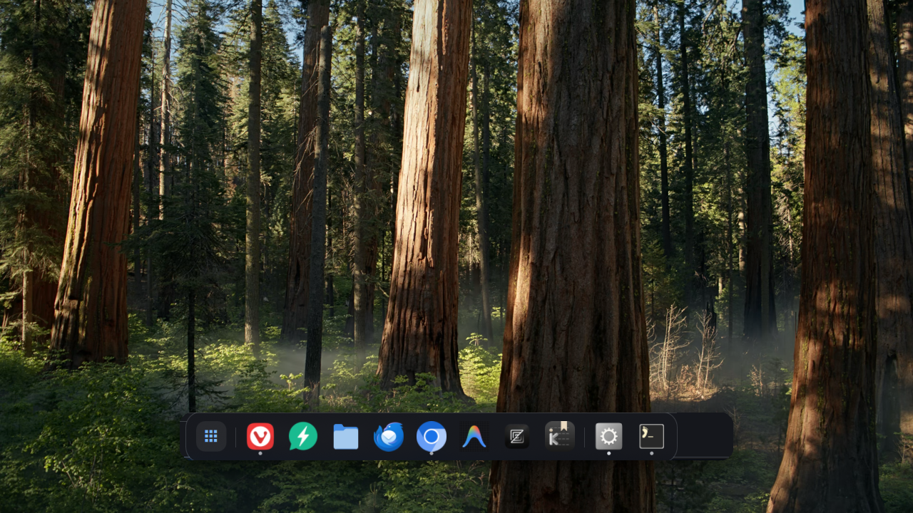

# macOS Magnify Dock for Omarchy

<div align="center">

[](https://omarchy.org)
[](https://quickshell.outfoxxed.me/)
[](https://hyprland.org/)
[](./LICENSE)

<br/>

**The authentic, fluid, and pointer-coupled macOS floating dock for Omarchy Quattro & Hyprland.**

<br/>



</div>

---

## 🍎 The Authentic macOS Experience on Linux

While most Wayland docks use static, fixed-size icon slots, **macOS Magnify Dock** is built from the ground up to recreate the signature feel, physics, and fluid aesthetics of the genuine Apple macOS Dock.

Every animation runs at your monitor's native refresh rate (144Hz, 180Hz, 200Hz+) with GPU-accelerated Wayland layer-shell rendering, zero cursor stutter, and seamless Omarchy theme sync.

---

## ✨ Key Features

* 🌊 **Pointer-Coupled Magnification Wave** — Experience the iconic macOS parabolic zoom wave. As your cursor glides across the dock, icons smoothly magnify up to 1.6× using a raised-cosine curve while neighboring icons seamlessly slide aside with fluid physical momentum.
* 🏀 **Launch Bounce Physics** — Just like on macOS, clicking to open an application sets the icon playfully bouncing in place until its Wayland window appears and settles smoothly into focus.
* 🪟 **Frosted Glass Floating Capsule** — Beautiful translucent glassmorphism with 3D top specular highlights, subtle borders, and smooth rounded corners ($18\text{px}$) that adapt to your Omarchy theme palette.
* 🔀 **Fluid Drag-and-Drop Reordering** — Long-click and drag pinned apps along the rail to reorder your favorites. Neighboring icons smoothly part ways in real time, settling with cubic easing upon release.
* 💡 **Live Running Indicators** — Unobtrusive running dots beneath open applications with real-time active window focus synchronization via Hyprland & Wayland `ToplevelManager`.
* ⏱️ **Intelligent Auto-Hide & Edge Reveal** — Keep the dock persistently visible with exclusive tiling space, or enable smooth edge-reveal auto-hide that glides into view when your pointer approaches the bottom edge.
* 🖱️ **Right-Click Context Menu** — Right-click any icon to bring windows to front, pin/unpin favorites ("Keep in Dock"), close active windows, or toggle dock preferences on the fly.
* 🖥️ **Native Multi-Monitor Support** — Automatically initializes independent, output-local dock instances across all connected displays without flickering or desync.
* ⚡ **Zero-Flicker Architecture** — Built natively on Quickshell and Wayland Layer Shell (`wlr-layer-shell`) with optimized input masks for flicker-free hover transitions.

---

## 📦 Installation

Install and enable the dock directly through the Omarchy CLI:

```bash
omarchy plugin add https://github.com/wisangdg/omarchy-magnify-dock.git --enable
```

To update to the latest version at any time:

```bash
omarchy plugin update wdg.dock --yes
```

To remove the dock and its saved state:

```bash
omarchy plugin remove wdg.dock --yes
```

### Requirements

- **Omarchy / Quickshell** — the shell host that loads the `panel` plugin.
- **Hyprland** (`hyprctl`) — window tracking, focus, close, and descendant PID lookup.
- **PipeWire or PulseAudio** (`pactl`) and **Python 3** — used by `dock-audio.py` for the per-application "Mute Audio" action. Mute state is stored in `~/.config/omarchy/dock-muted-apps.json`.
- **notify-send** (optional) — desktop notification when an app is muted or restored.

---

## 🎮 Controls & Interaction

| Gesture / Action | Control | Description |
| :--- | :--- | :--- |
| **Open / Focus Window** | `Left-Click` | Opens the application (with launch bounce) or brings the running window to front. |
| **Context Menu** | `Right-Click` | Displays macOS-style context menu (Keep in Dock, Bring to Front, Close, Options). |
| **Quick Close / Unpin** | `Middle-Click` | Closes the running window, or toggles the application's pinned state. |
| **Reorder Favorites** | `Click & Drag` | Drag any pinned app along the dock rail to reorder. |
| **App Drawer / Launcher** | `Click 󰀻 Icon` | Toggles the native Omarchy application launcher (leftmost button). |
| **Reveal Dock** | `Cursor to Edge` | Instantly reveals the dock when in Auto-hide mode. |
| **Choose a Window** | `Hover Running App` | Shows window titles and workspace/monitor labels. Click a row to focus that window or its close button to close only that window. |
| **Dock Settings** | `Right-Click Launcher` | Opens live appearance and window-filter settings. Also available in any app's context menu. |

---

## ⚙️ Configuration

Your preferences are automatically saved to `~/.config/omarchy/dock-pinned-macos.json`:

Open **Dock Settings…** from an app's context menu, or right-click the application
launcher. Icon size, magnification, spacing, background opacity, and auto-hide
delays update immediately and save automatically. Settings are shared across
monitors; other dock instances reload saved changes. Existing configurations
without a `settings` object continue to use the original appearance.

```json
{
  "version": 1,
  "autoHide": false,
  "reserveSpace": true,
  "settings": {
    "iconSize": 34,
    "magnification": 1.6,
    "spacing": 6,
    "opacity": 0.76,
    "revealDelay": 0,
    "hideDelay": 220,
    "windowScope": "all"
  },
  "pinned": [
    "vivaldi-stable",
    "elecwhat",
    "org.gnome.Nautilus",
    "org.mozilla.Thunderbird",
    "chromium",
    "antigravity-ide",
    "dev.zed.Zed",
    "io.github.troyeguo.koodo-reader"
  ]
}
```

* **`autoHide`** (`true` / `false`): Automatically slides the dock off-screen when inactive and reveals it upon touching the bottom screen edge.
* **`reserveSpace`** (`true` / `false`): Tells Hyprland to reserve exclusive screen space at the bottom so tiled windows stop cleanly above the dock capsule.
* **`pinned`** (array): The ordered list of desktop application IDs pinned to your dock favorites.

The `settings.windowScope` filter supports:

* **`all`**: Running windows across all monitors and workspaces (default).
* **`monitor`**: Running windows on the monitor containing this dock.
* **`workspace`**: Running windows on this monitor's active workspace. Each monitor follows its own active workspace, independently of keyboard focus.

Pinned shortcuts remain visible in every mode. Running dots, window counts,
click-to-focus targets, and the hover window picker use the selected scope.
An app with no windows in that scope behaves as a launcher. Windows whose
Hyprland metadata is not available yet appear in `all` mode; filtered modes
include them once their monitor and workspace are known.

Hovering a running app opens a scrollable window picker after 380 ms. It remains
open while the pointer moves into the picker, and suspends auto-hide until it
closes. This release shows titles and workspace labels, without thumbnail capture.

---

## 🛠️ Verification & Testing

This plugin includes an automated regression test suite ensuring zero regressions across window matching, pinned app persistence, and baseline geometry:

```bash
node tests/dock-regressions.cjs
omarchy plugin validate .
```

UI interaction tests require **Qt 6** (the unqualified `qmltestrunner` binary may
belong to Qt 5). They use a small test theme instead of loading the live shell:

```bash
QT_QPA_PLATFORM=offscreen QT_QPA_PLATFORMTHEME=generic QT_QUICK_CONTROLS_STYLE=Basic \
  /usr/lib/qt6/bin/qmltestrunner -input tests/qml -import tests/imports -o -,txt
```

---

## 📄 License

Distributed under the [MIT License](./LICENSE).  
Copyright © 2026 Wisang Drillian Geni ([@wisangdg](https://github.com/wisangdg)).
